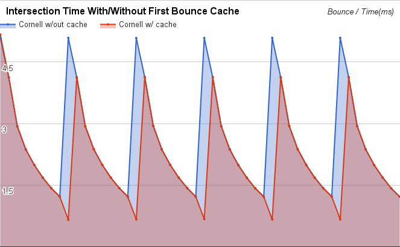

CUDA Path Tracer
================

**University of Pennsylvania, CIS 565: GPU Programming and Architecture, Project 3**

* Austin Eng
* Tested on: Windows 10, i7-4770K @ 3.50GHz 16GB, GTX 780 3072MB (Personal Computer)

## Stream Compaction

Stream compaction is useful for greatly reducing the number of rays being cast into the scene. This was done using `thrust::partition`. It was determined that `thrust::remove_if` invalidates the removed rays so that they cannot be used for final gathering. One possible solution would be to scan the array and partially gather terminating rays before removing them. However, this has little value as `thrust::remove_if` runs in approximately 0.6ms and `thrust::partition` runs in 1.2ms. Doing a partial gather would require another 0.6ms pass over the data and take just as long.

Below are the results of using stream compaction on various scenes. The Cornell box scene is open on one side while the Closed scene is exactly the same with an additional wall. The Veach scene has only a floor plane.

**All scenes were rendered to 256 samples per pixel. The average iteration time per bounce was logged and averaged.**

We can see that there are enormous improvements to using stream compaction in the open scenes. Doing so offers approximately a 3x speed up. It's interesting to note that even though the Veach scene has far fewer walls than the Cornell box scene, they both show approximately the same speedup. Unsurprisingly, the Closed scene has marginal benefits from the use of stream compaction. All of the rays stay active throughout their entire lifetime so they cannot be terminated.

## First-Bounce Caching

If all objects in the scene are static, it is very possible to cache the first intersection test to speed things up. However, I found that these had marginal improvements on performance. The following test was done with the Cornell box scene with a maximum path depth of 16. Because 15 of the bounces are completely uncached, there's little benefit in caching the first bounce. 

Here, we see that after 6 iterations, there is just a 20ms improvement in cumulative performance which is less than a 4ms speedup per iteration. Below, we can see the results from a maximum path length of 8. Even though a greater percentage of bounces are cached, the speedup is still not significant.

While these performance improvements may be helpful, they are ultimately not useful because caching these bounces will not work if stochastic antialiasing techniques are used (see next section).

## Stochastic Pixel Sampling

By randomizing the origin of every ray we cast from the camera, we can reduce artifacts that occur when frequencies in the geometry shape interefere with the pixel grid. At times, weird artifacts can occur and at other times, shapes may appear sharp or jagged. This effect is called aliasing. The process of antialiasing often involves casting multiple samples per pixel and averaging them, often resulting in a smoothing of edges.
In the images below, we can see that the image on the left has harsher edges on the sphere with some dark pixels on the edges. The antialiased image on the right smooths these artifacts and produces a cleaner image. For every iteration we simply choose a random point within the pixel from which to cast the ray.

## Stratified Hemisphere Sampling
With standard hemisphere sampling where we choose random directions in a hemisphere, it is easy to get an unbalanced distributions. While there ought to be a uniform distribution of rays within a lobe, pure random behavior takes many, many iterations to appropriately approximate a uniform distribution. Unfortunately, we also cannot simply sample the hemisphere like a grid or we would likely end up with image artifacts.

One solution is to do stratified sampling. This solves the problem by splitting the hemisphere into strata and then randomly sampling within that strata. In my tests, I used 256 strata. This means that on the FIRST bounce, of the ith iteration, instead of sampling randomly, we will instead sample randomly within the (i % 256)th stratum. This also means that we will only get unbiased images after 256 iterations and only iterations that are multiples of 256 will have unbiased results. A huge benefit, however is that the image will converge much faster, especially if diffuse surfaces are involved. Below we can see that the images on the right (stratified) have much less noise than those on the left.

**Note, this stratified sampling is also implemented for sampling lobes of Blinn-Phong materials.**

This was implemented by passing the iteration and depth to the `shade` function which would then select the approriate strata and sample within it. Two random variables were used as in typical hemisphere sampling. Their values were just scaled to fit within the chosen strata.

## Sobol Quasirandom Hemisphere Sampling
Sobol sampling is another sampling method that can be used to avoid uneven random sampling. Sobol sequences are quasirandom sequences which appear to be random, but have low discrepancy between samples. The result is well distributed samples with no discernable pattern. To implement this, I used cuRand which has builtin functionality to generate Sobol sequences, as well as many other random sequences. These were generated before shading the rays and all the random values for all the pixels were stored in GPU memory. One of the huge benefits of quasirandom sampling is that you get the benefits of random sampling, but do not require a certain number of iterations like stratified sampling.

Though quasirandom sampling has nice interactive benefits (every iteration is unbiased), it may not ultimately be worth it for maximum render performance. The Sobol sequence generation incurs a large overhead that makes the sobol sequence methods much slower. Stratified sampling produces results that are visually equivalent with almost no overhead from computing random numbers.

One thing I would like to explore is computing sobol sequences on the device and not using cuRand or perhaps computing these random sequencse on the CPU while the GPU is doing other work. This may help to mitigate the performance benefits of using cuRand.

## Materials

Multiple materials were implemented. Refraction with fresnel, reflection, partially specular surfaces. Currently these all occur in one uber shader. In the future I would like to break this into multiple shader calls.